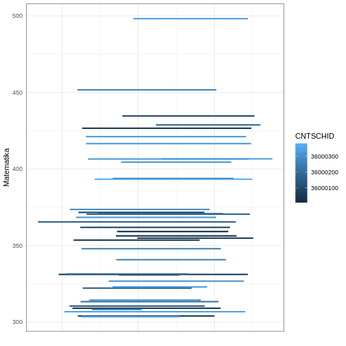
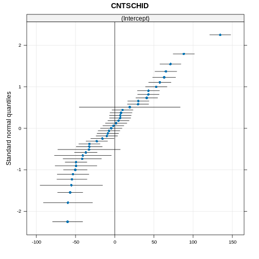

``` output
── Attaching core tidyverse packages ──────────────────────── tidyverse 2.0.0 ──
✔ dplyr     1.1.4     ✔ readr     2.1.5
✔ forcats   1.0.0     ✔ stringr   1.5.1
✔ ggplot2   3.5.1     ✔ tibble    3.2.1
✔ lubridate 1.9.3     ✔ tidyr     1.3.1
✔ purrr     1.0.2     
── Conflicts ────────────────────────────────────────── tidyverse_conflicts() ──
✖ dplyr::filter() masks stats::filter()
✖ dplyr::lag()    masks stats::lag()
ℹ Use the conflicted package (<http://conflicted.r-lib.org/>) to force all conflicts to become errors
```

## Estimate null model

The first model created in multilevel modelling is the null model, which is a simple model with no predictors. By creating a null model we know how much variation we have at each level. The first step is to run the *package* `lme4`, then create the model using the `lmer()` function.


``` r
library(lme4)
```

``` output
Loading required package: Matrix
```

``` output

Attaching package: 'Matrix'
```

``` output
The following objects are masked from 'package:tidyr':

    expand, pack, unpack
```

``` r
m0 <- lmer(MATH ~ 1 + (1 | CNTSCHID), data = pisa)
```

## Null model result

To view the model results, we can run the `summary()` function and put the model `m0` inside the bracket.


``` r
summary(m0)
```

``` output
Linear mixed model fit by REML ['lmerMod']
Formula: MATH ~ 1 + (1 | CNTSCHID)
   Data: pisa

REML criterion at convergence: 13681.5

Scaled residuals: 
    Min      1Q  Median      3Q     Max 
-2.8568 -0.6436 -0.0624  0.6143  4.5990 

Random effects:
 Groups   Name        Variance Std.Dev.
 CNTSCHID (Intercept) 2333     48.30   
 Residual             2012     44.86   
Number of obs: 1297, groups:  CNTSCHID, 41

Fixed effects:
            Estimate Std. Error t value
(Intercept)  363.631      7.737      47
```

## Find ICC

Then we can find the ICC score manually by calculating the proportion of school variation divided by the sum of school variation and individual variation. Besides calculating manually, we can find the ICC score using the `tab_model()` function of *package* `sjPlot`.


``` r
library(sjPlot)
```

``` output
#refugeeswelcome
```

``` r
tab_model(m0)
```

<table style="border-collapse:collapse; border:none;">
<tr>
<th style="border-top: double; text-align:center; font-style:normal; font-weight:bold; padding:0.2cm;  text-align:left; ">&nbsp;</th>
<th colspan="3" style="border-top: double; text-align:center; font-style:normal; font-weight:bold; padding:0.2cm; ">MATH</th>
</tr>
<tr>
<td style=" text-align:center; border-bottom:1px solid; font-style:italic; font-weight:normal;  text-align:left; ">Predictors</td>
<td style=" text-align:center; border-bottom:1px solid; font-style:italic; font-weight:normal;  ">Estimates</td>
<td style=" text-align:center; border-bottom:1px solid; font-style:italic; font-weight:normal;  ">CI</td>
<td style=" text-align:center; border-bottom:1px solid; font-style:italic; font-weight:normal;  ">p</td>
</tr>
<tr>
<td style=" padding:0.2cm; text-align:left; vertical-align:top; text-align:left; ">(Intercept)</td>
<td style=" padding:0.2cm; text-align:left; vertical-align:top; text-align:center;  ">363.63</td>
<td style=" padding:0.2cm; text-align:left; vertical-align:top; text-align:center;  ">348.45&nbsp;&ndash;&nbsp;378.81</td>
<td style=" padding:0.2cm; text-align:left; vertical-align:top; text-align:center;  "><strong>&lt;0.001</strong></td>
</tr>
<tr>
<td colspan="4" style="font-weight:bold; text-align:left; padding-top:.8em;">Random Effects</td>
</tr>

<tr>
<td style=" padding:0.2cm; text-align:left; vertical-align:top; text-align:left; padding-top:0.1cm; padding-bottom:0.1cm;">&sigma;<sup>2</sup></td>
<td style=" padding:0.2cm; text-align:left; vertical-align:top; padding-top:0.1cm; padding-bottom:0.1cm; text-align:left;" colspan="3">2012.22</td>
</tr>

<tr>
<td style=" padding:0.2cm; text-align:left; vertical-align:top; text-align:left; padding-top:0.1cm; padding-bottom:0.1cm;">&tau;<sub>00</sub> <sub>CNTSCHID</sub></td>
<td style=" padding:0.2cm; text-align:left; vertical-align:top; padding-top:0.1cm; padding-bottom:0.1cm; text-align:left;" colspan="3">2332.65</td>

<tr>
<td style=" padding:0.2cm; text-align:left; vertical-align:top; text-align:left; padding-top:0.1cm; padding-bottom:0.1cm;">ICC</td>
<td style=" padding:0.2cm; text-align:left; vertical-align:top; padding-top:0.1cm; padding-bottom:0.1cm; text-align:left;" colspan="3">0.54</td>

<tr>
<td style=" padding:0.2cm; text-align:left; vertical-align:top; text-align:left; padding-top:0.1cm; padding-bottom:0.1cm;">N <sub>CNTSCHID</sub></td>
<td style=" padding:0.2cm; text-align:left; vertical-align:top; padding-top:0.1cm; padding-bottom:0.1cm; text-align:left;" colspan="3">41</td>
<tr>
<td style=" padding:0.2cm; text-align:left; vertical-align:top; text-align:left; padding-top:0.1cm; padding-bottom:0.1cm; border-top:1px solid;">Observations</td>
<td style=" padding:0.2cm; text-align:left; vertical-align:top; padding-top:0.1cm; padding-bottom:0.1cm; text-align:left; border-top:1px solid;" colspan="3">1297</td>
</tr>
<tr>
<td style=" padding:0.2cm; text-align:left; vertical-align:top; text-align:left; padding-top:0.1cm; padding-bottom:0.1cm;">Marginal R<sup>2</sup> / Conditional R<sup>2</sup></td>
<td style=" padding:0.2cm; text-align:left; vertical-align:top; padding-top:0.1cm; padding-bottom:0.1cm; text-align:left;" colspan="3">0.000 / 0.537</td>
</tr>

</table>

## Understanding ICC with Plot

Furthermore, to understand the meaning of school-level and individual-level variations, we can look at the graph across all schools. School-level variation comes from how different the lines (ESCS) are between schools. If the variation is low, the lines will be very similar. On the other hand, if the variation is large, then the lines will be very different. Individual-level variation is a summary of the differences between individuals (dots) and schools (lines).

The first step we take to graph the model for all schools is to predict the scores based on the model we created using the `predict()` function and save it as a new variable in our data.


``` r
pisa$m0 <- predict(m0)
```

## Null model plot

Second, create a graph showing the linear mean line for each school using `ggplot()` and the function `geom_smooth(se = F, method = lm)`, to estimate the linear trend without confidence intervals.


``` r
pisa %>% 
  ggplot(aes(ESCS, m0, color = CNTSCHID, group = CNTSCHID)) + 
  geom_smooth(se = F, method = lm) +
  theme_bw() +
  theme(axis.text.x = element_blank(),
        axis.ticks = element_blank()) +
  labs(x = "", y = "Matematika", color = "CNTSCHID")
```

``` output
`geom_smooth()` using formula = 'y ~ x'
```



## Plotting with `qqmath`

Beside using `ggplot()`, we can visualise the random effects using dotplot from `lattice` *package*  using `qqmath()` and with random effect from the model using `ranef()`.


``` r
library(lattice)

qqmath(ranef(m0, condVar = TRUE))
```

``` output
$CNTSCHID
```



In the graph, each dot represents a school and the line represents a confidence interval. 0 is an intercept in $x$ axis.

