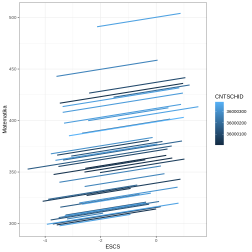
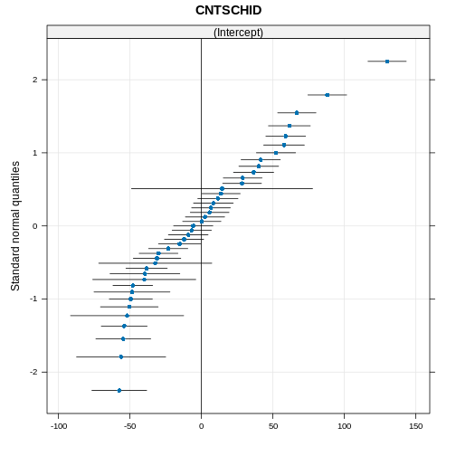

``` output
── Attaching core tidyverse packages ──────────────────────── tidyverse 2.0.0 ──
✔ dplyr     1.1.4     ✔ readr     2.1.5
✔ forcats   1.0.0     ✔ stringr   1.5.1
✔ ggplot2   3.5.1     ✔ tibble    3.2.1
✔ lubridate 1.9.3     ✔ tidyr     1.3.1
✔ purrr     1.0.2     
── Conflicts ────────────────────────────────────────── tidyverse_conflicts() ──
✖ dplyr::filter() masks stats::filter()
✖ dplyr::lag()    masks stats::lag()
ℹ Use the conflicted package (<http://conflicted.r-lib.org/>) to force all conflicts to become errors
Loading required package: Matrix


Attaching package: 'Matrix'


The following objects are masked from 'package:tidyr':

    expand, pack, unpack


Learn more about sjPlot with 'browseVignettes("sjPlot")'.
```

## Creating Random Intercept Model

If we have previously created a null model without predictors, in the random intercept model we will include predictors. For example, if we want to know the relationship between ESCS and maths achievement, we can easily create the model with the same steps as when we created the null model.


``` r
m1 <- lmer(MATH ~ 1 + ESCS + (1 | CNTSCHID), data = pisa)
```

## The result


``` r
summary(m1)
```

``` output
Linear mixed model fit by REML ['lmerMod']
Formula: MATH ~ 1 + ESCS + (1 | CNTSCHID)
   Data: pisa

REML criterion at convergence: 13670.3

Scaled residuals: 
    Min      1Q  Median      3Q     Max 
-3.0591 -0.6366 -0.0336  0.6187  4.5086 

Random effects:
 Groups   Name        Variance Std.Dev.
 CNTSCHID (Intercept) 2184     46.73   
 Residual             2004     44.77   
Number of obs: 1297, groups:  CNTSCHID, 41

Fixed effects:
            Estimate Std. Error t value
(Intercept)  370.330      7.833  47.280
ESCS           4.326      1.474   2.934

Correlation of Fixed Effects:
     (Intr)
ESCS 0.290 
```

## ICC result


``` r
tab_model(m1)
```

<table style="border-collapse:collapse; border:none;">
<tr>
<th style="border-top: double; text-align:center; font-style:normal; font-weight:bold; padding:0.2cm;  text-align:left; ">&nbsp;</th>
<th colspan="3" style="border-top: double; text-align:center; font-style:normal; font-weight:bold; padding:0.2cm; ">MATH</th>
</tr>
<tr>
<td style=" text-align:center; border-bottom:1px solid; font-style:italic; font-weight:normal;  text-align:left; ">Predictors</td>
<td style=" text-align:center; border-bottom:1px solid; font-style:italic; font-weight:normal;  ">Estimates</td>
<td style=" text-align:center; border-bottom:1px solid; font-style:italic; font-weight:normal;  ">CI</td>
<td style=" text-align:center; border-bottom:1px solid; font-style:italic; font-weight:normal;  ">p</td>
</tr>
<tr>
<td style=" padding:0.2cm; text-align:left; vertical-align:top; text-align:left; ">(Intercept)</td>
<td style=" padding:0.2cm; text-align:left; vertical-align:top; text-align:center;  ">370.33</td>
<td style=" padding:0.2cm; text-align:left; vertical-align:top; text-align:center;  ">354.96&nbsp;&ndash;&nbsp;385.70</td>
<td style=" padding:0.2cm; text-align:left; vertical-align:top; text-align:center;  "><strong>&lt;0.001</strong></td>
</tr>
<tr>
<td style=" padding:0.2cm; text-align:left; vertical-align:top; text-align:left; ">ESCS</td>
<td style=" padding:0.2cm; text-align:left; vertical-align:top; text-align:center;  ">4.33</td>
<td style=" padding:0.2cm; text-align:left; vertical-align:top; text-align:center;  ">1.43&nbsp;&ndash;&nbsp;7.22</td>
<td style=" padding:0.2cm; text-align:left; vertical-align:top; text-align:center;  "><strong>0.003</strong></td>
</tr>
<tr>
<td colspan="4" style="font-weight:bold; text-align:left; padding-top:.8em;">Random Effects</td>
</tr>

<tr>
<td style=" padding:0.2cm; text-align:left; vertical-align:top; text-align:left; padding-top:0.1cm; padding-bottom:0.1cm;">&sigma;<sup>2</sup></td>
<td style=" padding:0.2cm; text-align:left; vertical-align:top; padding-top:0.1cm; padding-bottom:0.1cm; text-align:left;" colspan="3">2004.21</td>
</tr>

<tr>
<td style=" padding:0.2cm; text-align:left; vertical-align:top; text-align:left; padding-top:0.1cm; padding-bottom:0.1cm;">&tau;<sub>00</sub> <sub>CNTSCHID</sub></td>
<td style=" padding:0.2cm; text-align:left; vertical-align:top; padding-top:0.1cm; padding-bottom:0.1cm; text-align:left;" colspan="3">2183.92</td>

<tr>
<td style=" padding:0.2cm; text-align:left; vertical-align:top; text-align:left; padding-top:0.1cm; padding-bottom:0.1cm;">ICC</td>
<td style=" padding:0.2cm; text-align:left; vertical-align:top; padding-top:0.1cm; padding-bottom:0.1cm; text-align:left;" colspan="3">0.52</td>

<tr>
<td style=" padding:0.2cm; text-align:left; vertical-align:top; text-align:left; padding-top:0.1cm; padding-bottom:0.1cm;">N <sub>CNTSCHID</sub></td>
<td style=" padding:0.2cm; text-align:left; vertical-align:top; padding-top:0.1cm; padding-bottom:0.1cm; text-align:left;" colspan="3">41</td>
<tr>
<td style=" padding:0.2cm; text-align:left; vertical-align:top; text-align:left; padding-top:0.1cm; padding-bottom:0.1cm; border-top:1px solid;">Observations</td>
<td style=" padding:0.2cm; text-align:left; vertical-align:top; padding-top:0.1cm; padding-bottom:0.1cm; text-align:left; border-top:1px solid;" colspan="3">1297</td>
</tr>
<tr>
<td style=" padding:0.2cm; text-align:left; vertical-align:top; text-align:left; padding-top:0.1cm; padding-bottom:0.1cm;">Marginal R<sup>2</sup> / Conditional R<sup>2</sup></td>
<td style=" padding:0.2cm; text-align:left; vertical-align:top; padding-top:0.1cm; padding-bottom:0.1cm; text-align:left;" colspan="3">0.005 / 0.524</td>
</tr>

</table>

## Prediction plot


``` r
pisa$m1 <- predict(m1)

pisa %>% 
  ggplot(aes(ESCS, m1, color = CNTSCHID, group = CNTSCHID)) + 
  geom_smooth(se = F, method = lm) +
  theme_bw() +
  labs(x = "ESCS", 
       y = "Matematika", 
       color = "CNTSCHID")
```

``` output
`geom_smooth()` using formula = 'y ~ x'
```



## QQ-plot


``` r
qqmath(ranef(m1, condVar = TRUE))
```

``` output
$CNTSCHID
```




