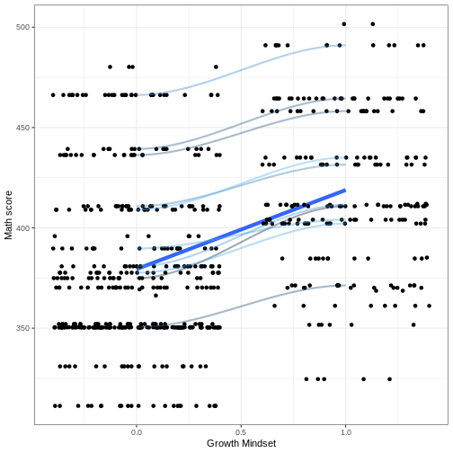
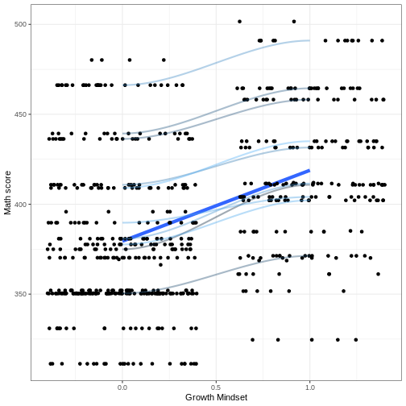
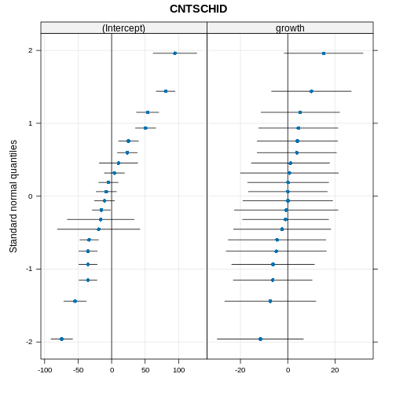
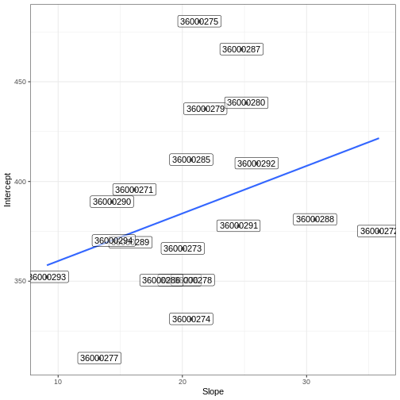

``` output
Loading required package: Matrix
```

``` output
Learn more about sjPlot with 'browseVignettes("sjPlot")'.
```

``` output
── Attaching core tidyverse packages ──────────────────────── tidyverse 2.0.0 ──
✔ dplyr     1.1.4     ✔ readr     2.1.5
✔ forcats   1.0.0     ✔ stringr   1.5.1
✔ ggplot2   3.5.1     ✔ tibble    3.2.1
✔ lubridate 1.9.3     ✔ tidyr     1.3.1
✔ purrr     1.0.2     
── Conflicts ────────────────────────────────────────── tidyverse_conflicts() ──
✖ tidyr::expand() masks Matrix::expand()
✖ dplyr::filter() masks stats::filter()
✖ dplyr::lag()    masks stats::lag()
✖ tidyr::pack()   masks Matrix::pack()
✖ tidyr::unpack() masks Matrix::unpack()
ℹ Use the conflicted package (<http://conflicted.r-lib.org/>) to force all conflicts to become errors
New names:
Rows: 13439 Columns: 9
── Column specification ────────────────────────────────────────────────────────
Delimiter: ","
dbl (9): ...1, CNTRYID, CNTSCHID, age, sex, ESCS, SES, MATH, growth

ℹ Use `spec()` to retrieve the full column specification for this data.
ℹ Specify the column types or set `show_col_types = FALSE` to quiet this message.
```

# Random Slope

- The previous model makes the assumption that the effect of growth mindset is the same across all schools (that's why the lines are parallel).

- What if one growth mindset score is more ‘effective’ in some schools than others in improving maths scores.

- At this point a random slope is needed.

- We get a new coefficient that describes the differences between schools in the effect of growth mindset on maths scores.

## Random Slope Estimation


``` r
# model with random slope
m2 <- lmer(MATH ~ 1 + growth + 
             (1 + growth | CNTSCHID), 
           data = skor)
# print results
summary(m2)
```

``` output
Linear mixed model fit by REML ['lmerMod']
Formula: MATH ~ 1 + growth + (1 + growth | CNTSCHID)
   Data: skor

REML criterion at convergence: 6742.1

Scaled residuals: 
    Min      1Q  Median      3Q     Max 
-2.5923 -0.7214 -0.0927  0.6729  3.7811 

Random effects:
 Groups   Name        Variance Std.Dev. Corr
 CNTSCHID (Intercept) 2081.8   45.63        
          growth       126.2   11.23    0.14
 Residual             1876.3   43.32        
Number of obs: 644, groups:  CNTSCHID, 20

Fixed effects:
            Estimate Std. Error t value
(Intercept)  385.608     10.652  36.201
growth        20.687      4.692   4.409

Correlation of Fixed Effects:
       (Intr)
growth -0.026
```

## Random Slope Estimation


``` r
tab_model(m2, show.icc = TRUE)
```

<table style="border-collapse:collapse; border:none;">
<tr>
<th style="border-top: double; text-align:center; font-style:normal; font-weight:bold; padding:0.2cm;  text-align:left; ">&nbsp;</th>
<th colspan="3" style="border-top: double; text-align:center; font-style:normal; font-weight:bold; padding:0.2cm; ">MATH</th>
</tr>
<tr>
<td style=" text-align:center; border-bottom:1px solid; font-style:italic; font-weight:normal;  text-align:left; ">Predictors</td>
<td style=" text-align:center; border-bottom:1px solid; font-style:italic; font-weight:normal;  ">Estimates</td>
<td style=" text-align:center; border-bottom:1px solid; font-style:italic; font-weight:normal;  ">CI</td>
<td style=" text-align:center; border-bottom:1px solid; font-style:italic; font-weight:normal;  ">p</td>
</tr>
<tr>
<td style=" padding:0.2cm; text-align:left; vertical-align:top; text-align:left; ">(Intercept)</td>
<td style=" padding:0.2cm; text-align:left; vertical-align:top; text-align:center;  ">385.61</td>
<td style=" padding:0.2cm; text-align:left; vertical-align:top; text-align:center;  ">364.69&nbsp;&ndash;&nbsp;406.52</td>
<td style=" padding:0.2cm; text-align:left; vertical-align:top; text-align:center;  "><strong>&lt;0.001</strong></td>
</tr>
<tr>
<td style=" padding:0.2cm; text-align:left; vertical-align:top; text-align:left; ">growth</td>
<td style=" padding:0.2cm; text-align:left; vertical-align:top; text-align:center;  ">20.69</td>
<td style=" padding:0.2cm; text-align:left; vertical-align:top; text-align:center;  ">11.47&nbsp;&ndash;&nbsp;29.90</td>
<td style=" padding:0.2cm; text-align:left; vertical-align:top; text-align:center;  "><strong>&lt;0.001</strong></td>
</tr>
<tr>
<td colspan="4" style="font-weight:bold; text-align:left; padding-top:.8em;">Random Effects</td>
</tr>

<tr>
<td style=" padding:0.2cm; text-align:left; vertical-align:top; text-align:left; padding-top:0.1cm; padding-bottom:0.1cm;">&sigma;<sup>2</sup></td>
<td style=" padding:0.2cm; text-align:left; vertical-align:top; padding-top:0.1cm; padding-bottom:0.1cm; text-align:left;" colspan="3">1876.27</td>
</tr>

<tr>
<td style=" padding:0.2cm; text-align:left; vertical-align:top; text-align:left; padding-top:0.1cm; padding-bottom:0.1cm;">&tau;<sub>00</sub> <sub>CNTSCHID</sub></td>
<td style=" padding:0.2cm; text-align:left; vertical-align:top; padding-top:0.1cm; padding-bottom:0.1cm; text-align:left;" colspan="3">2081.84</td>

<tr>
<td style=" padding:0.2cm; text-align:left; vertical-align:top; text-align:left; padding-top:0.1cm; padding-bottom:0.1cm;">&tau;<sub>11</sub> <sub>CNTSCHID.growth</sub></td>
<td style=" padding:0.2cm; text-align:left; vertical-align:top; padding-top:0.1cm; padding-bottom:0.1cm; text-align:left;" colspan="3">126.17</td>

<tr>
<td style=" padding:0.2cm; text-align:left; vertical-align:top; text-align:left; padding-top:0.1cm; padding-bottom:0.1cm;">&rho;<sub>01</sub> <sub>CNTSCHID</sub></td>
<td style=" padding:0.2cm; text-align:left; vertical-align:top; padding-top:0.1cm; padding-bottom:0.1cm; text-align:left;" colspan="3">0.14</td>

<tr>
<td style=" padding:0.2cm; text-align:left; vertical-align:top; text-align:left; padding-top:0.1cm; padding-bottom:0.1cm;">ICC</td>
<td style=" padding:0.2cm; text-align:left; vertical-align:top; padding-top:0.1cm; padding-bottom:0.1cm; text-align:left;" colspan="3">0.54</td>

<tr>
<td style=" padding:0.2cm; text-align:left; vertical-align:top; text-align:left; padding-top:0.1cm; padding-bottom:0.1cm;">N <sub>CNTSCHID</sub></td>
<td style=" padding:0.2cm; text-align:left; vertical-align:top; padding-top:0.1cm; padding-bottom:0.1cm; text-align:left;" colspan="3">20</td>
<tr>
<td style=" padding:0.2cm; text-align:left; vertical-align:top; text-align:left; padding-top:0.1cm; padding-bottom:0.1cm; border-top:1px solid;">Observations</td>
<td style=" padding:0.2cm; text-align:left; vertical-align:top; padding-top:0.1cm; padding-bottom:0.1cm; text-align:left; border-top:1px solid;" colspan="3">644</td>
</tr>
<tr>
<td style=" padding:0.2cm; text-align:left; vertical-align:top; text-align:left; padding-top:0.1cm; padding-bottom:0.1cm;">Marginal R<sup>2</sup> / Conditional R<sup>2</sup></td>
<td style=" padding:0.2cm; text-align:left; vertical-align:top; padding-top:0.1cm; padding-bottom:0.1cm; text-align:left;" colspan="3">0.024 / 0.548</td>
</tr>

</table>

## Interpretation

- The fixed effect of growth mindset is smaller than in model 1 and we have a new random effect coefficient.
- The random slope variance for years of education is 73.29.

## Density


``` r
skor$m2 <- predict(m2)
# visualize the predictions based on our model
skor %>% 
  ggplot(aes(growth, m2)) + 
  geom_smooth(se = F, method = lm, size = 2) +
  geom_jitter()+
  stat_smooth(aes(color = CNTSCHID, group = CNTSCHID),
              geom = "line", alpha = 0.4, size = 1) +
  theme_bw() +
  guides(color = F) +
  labs(x = "Growth Mindset", 
       y = "Math score", 
       color = "School")
```

``` warning
Warning: Using `size` aesthetic for lines was deprecated in ggplot2 3.4.0.
ℹ Please use `linewidth` instead.
This warning is displayed once every 8 hours.
Call `lifecycle::last_lifecycle_warnings()` to see where this warning was
generated.
```

``` warning
Warning: The `<scale>` argument of `guides()` cannot be `FALSE`. Use "none" instead as
of ggplot2 3.3.4.
This warning is displayed once every 8 hours.
Call `lifecycle::last_lifecycle_warnings()` to see where this warning was
generated.
```

``` output
`geom_smooth()` using formula = 'y ~ x'
`geom_smooth()` using method = 'loess' and formula = 'y ~ x'
```

``` warning
Warning in simpleLoess(y, x, w, span, degree = degree, parametric = parametric,
: at -0.005
```

``` warning
Warning in simpleLoess(y, x, w, span, degree = degree, parametric = parametric,
: radius 2.5e-05
```

``` warning
Warning in simpleLoess(y, x, w, span, degree = degree, parametric = parametric,
: all data on boundary of neighborhood. make span bigger
```

``` warning
Warning in simpleLoess(y, x, w, span, degree = degree, parametric = parametric,
: pseudoinverse used at -0.005
```

``` warning
Warning in simpleLoess(y, x, w, span, degree = degree, parametric = parametric,
: neighborhood radius 0.005
```

``` warning
Warning in simpleLoess(y, x, w, span, degree = degree, parametric = parametric,
: reciprocal condition number 1
```

``` warning
Warning in simpleLoess(y, x, w, span, degree = degree, parametric = parametric,
: There are other near singularities as well. 1.01
```

``` warning
Warning in simpleLoess(y, x, w, span, degree = degree, parametric = parametric,
: zero-width neighborhood. make span bigger
```

``` warning
Warning: Failed to fit group 1.
Caused by error in `predLoess()`:
! NA/NaN/Inf in foreign function call (arg 5)
```

``` warning
Warning in simpleLoess(y, x, w, span, degree = degree, parametric = parametric,
: pseudoinverse used at -0.005
```

``` warning
Warning in simpleLoess(y, x, w, span, degree = degree, parametric = parametric,
: neighborhood radius 1.005
```

``` warning
Warning in simpleLoess(y, x, w, span, degree = degree, parametric = parametric,
: reciprocal condition number 0
```

``` warning
Warning in simpleLoess(y, x, w, span, degree = degree, parametric = parametric,
: There are other near singularities as well. 1.01
```

``` warning
Warning in predLoess(object$y, object$x, newx = if (is.null(newdata)) object$x
else if (is.data.frame(newdata))
as.matrix(model.frame(delete.response(terms(object)), : pseudoinverse used at
-0.005
```

``` warning
Warning in predLoess(object$y, object$x, newx = if (is.null(newdata)) object$x
else if (is.data.frame(newdata))
as.matrix(model.frame(delete.response(terms(object)), : neighborhood radius
1.005
```

``` warning
Warning in predLoess(object$y, object$x, newx = if (is.null(newdata)) object$x
else if (is.data.frame(newdata))
as.matrix(model.frame(delete.response(terms(object)), : reciprocal condition
number 0
```

``` warning
Warning in predLoess(object$y, object$x, newx = if (is.null(newdata)) object$x
else if (is.data.frame(newdata))
as.matrix(model.frame(delete.response(terms(object)), : There are other near
singularities as well. 1.01
```

``` warning
Warning in simpleLoess(y, x, w, span, degree = degree, parametric = parametric,
: at -0.005
```

``` warning
Warning in simpleLoess(y, x, w, span, degree = degree, parametric = parametric,
: radius 2.5e-05
```

``` warning
Warning in simpleLoess(y, x, w, span, degree = degree, parametric = parametric,
: all data on boundary of neighborhood. make span bigger
```

``` warning
Warning in simpleLoess(y, x, w, span, degree = degree, parametric = parametric,
: pseudoinverse used at -0.005
```

``` warning
Warning in simpleLoess(y, x, w, span, degree = degree, parametric = parametric,
: neighborhood radius 0.005
```

``` warning
Warning in simpleLoess(y, x, w, span, degree = degree, parametric = parametric,
: reciprocal condition number 1
```

``` warning
Warning in simpleLoess(y, x, w, span, degree = degree, parametric = parametric,
: There are other near singularities as well. 1.01
```

``` warning
Warning in simpleLoess(y, x, w, span, degree = degree, parametric = parametric,
: zero-width neighborhood. make span bigger
```

``` warning
Warning: Failed to fit group 4.
Caused by error in `predLoess()`:
! NA/NaN/Inf in foreign function call (arg 5)
```

``` warning
Warning in simpleLoess(y, x, w, span, degree = degree, parametric = parametric,
: at -0.005
```

``` warning
Warning in simpleLoess(y, x, w, span, degree = degree, parametric = parametric,
: radius 2.5e-05
```

``` warning
Warning in simpleLoess(y, x, w, span, degree = degree, parametric = parametric,
: all data on boundary of neighborhood. make span bigger
```

``` warning
Warning in simpleLoess(y, x, w, span, degree = degree, parametric = parametric,
: pseudoinverse used at -0.005
```

``` warning
Warning in simpleLoess(y, x, w, span, degree = degree, parametric = parametric,
: neighborhood radius 0.005
```

``` warning
Warning in simpleLoess(y, x, w, span, degree = degree, parametric = parametric,
: reciprocal condition number 1
```

``` warning
Warning in simpleLoess(y, x, w, span, degree = degree, parametric = parametric,
: There are other near singularities as well. 1.01
```

``` warning
Warning in simpleLoess(y, x, w, span, degree = degree, parametric = parametric,
: zero-width neighborhood. make span bigger
```

``` warning
Warning: Failed to fit group 5.
Caused by error in `predLoess()`:
! NA/NaN/Inf in foreign function call (arg 5)
```

``` warning
Warning in simpleLoess(y, x, w, span, degree = degree, parametric = parametric,
: at -0.005
```

``` warning
Warning in simpleLoess(y, x, w, span, degree = degree, parametric = parametric,
: radius 2.5e-05
```

``` warning
Warning in simpleLoess(y, x, w, span, degree = degree, parametric = parametric,
: all data on boundary of neighborhood. make span bigger
```

``` warning
Warning in simpleLoess(y, x, w, span, degree = degree, parametric = parametric,
: pseudoinverse used at -0.005
```

``` warning
Warning in simpleLoess(y, x, w, span, degree = degree, parametric = parametric,
: neighborhood radius 0.005
```

``` warning
Warning in simpleLoess(y, x, w, span, degree = degree, parametric = parametric,
: reciprocal condition number 1
```

``` warning
Warning in simpleLoess(y, x, w, span, degree = degree, parametric = parametric,
: There are other near singularities as well. 1.01
```

``` warning
Warning in simpleLoess(y, x, w, span, degree = degree, parametric = parametric,
: zero-width neighborhood. make span bigger
```

``` warning
Warning: Failed to fit group 6.
Caused by error in `predLoess()`:
! NA/NaN/Inf in foreign function call (arg 5)
```

``` warning
Warning in simpleLoess(y, x, w, span, degree = degree, parametric = parametric,
: at -0.005
```

``` warning
Warning in simpleLoess(y, x, w, span, degree = degree, parametric = parametric,
: radius 2.5e-05
```

``` warning
Warning in simpleLoess(y, x, w, span, degree = degree, parametric = parametric,
: all data on boundary of neighborhood. make span bigger
```

``` warning
Warning in simpleLoess(y, x, w, span, degree = degree, parametric = parametric,
: pseudoinverse used at -0.005
```

``` warning
Warning in simpleLoess(y, x, w, span, degree = degree, parametric = parametric,
: neighborhood radius 0.005
```

``` warning
Warning in simpleLoess(y, x, w, span, degree = degree, parametric = parametric,
: reciprocal condition number 1
```

``` warning
Warning in simpleLoess(y, x, w, span, degree = degree, parametric = parametric,
: There are other near singularities as well. 1.01
```

``` warning
Warning in simpleLoess(y, x, w, span, degree = degree, parametric = parametric,
: zero-width neighborhood. make span bigger
```

``` warning
Warning: Failed to fit group 7.
Caused by error in `predLoess()`:
! NA/NaN/Inf in foreign function call (arg 5)
```

``` warning
Warning in simpleLoess(y, x, w, span, degree = degree, parametric = parametric,
: pseudoinverse used at -0.005
```

``` warning
Warning in simpleLoess(y, x, w, span, degree = degree, parametric = parametric,
: neighborhood radius 1.005
```

``` warning
Warning in simpleLoess(y, x, w, span, degree = degree, parametric = parametric,
: reciprocal condition number 0
```

``` warning
Warning in simpleLoess(y, x, w, span, degree = degree, parametric = parametric,
: There are other near singularities as well. 1.01
```

``` warning
Warning in predLoess(object$y, object$x, newx = if (is.null(newdata)) object$x
else if (is.data.frame(newdata))
as.matrix(model.frame(delete.response(terms(object)), : pseudoinverse used at
-0.005
```

``` warning
Warning in predLoess(object$y, object$x, newx = if (is.null(newdata)) object$x
else if (is.data.frame(newdata))
as.matrix(model.frame(delete.response(terms(object)), : neighborhood radius
1.005
```

``` warning
Warning in predLoess(object$y, object$x, newx = if (is.null(newdata)) object$x
else if (is.data.frame(newdata))
as.matrix(model.frame(delete.response(terms(object)), : reciprocal condition
number 0
```

``` warning
Warning in predLoess(object$y, object$x, newx = if (is.null(newdata)) object$x
else if (is.data.frame(newdata))
as.matrix(model.frame(delete.response(terms(object)), : There are other near
singularities as well. 1.01
```

``` warning
Warning in simpleLoess(y, x, w, span, degree = degree, parametric = parametric,
: pseudoinverse used at -0.005
```

``` warning
Warning in simpleLoess(y, x, w, span, degree = degree, parametric = parametric,
: neighborhood radius 1.005
```

``` warning
Warning in simpleLoess(y, x, w, span, degree = degree, parametric = parametric,
: reciprocal condition number 0
```

``` warning
Warning in simpleLoess(y, x, w, span, degree = degree, parametric = parametric,
: There are other near singularities as well. 1.01
```

``` warning
Warning in predLoess(object$y, object$x, newx = if (is.null(newdata)) object$x
else if (is.data.frame(newdata))
as.matrix(model.frame(delete.response(terms(object)), : pseudoinverse used at
-0.005
```

``` warning
Warning in predLoess(object$y, object$x, newx = if (is.null(newdata)) object$x
else if (is.data.frame(newdata))
as.matrix(model.frame(delete.response(terms(object)), : neighborhood radius
1.005
```

``` warning
Warning in predLoess(object$y, object$x, newx = if (is.null(newdata)) object$x
else if (is.data.frame(newdata))
as.matrix(model.frame(delete.response(terms(object)), : reciprocal condition
number 0
```

``` warning
Warning in predLoess(object$y, object$x, newx = if (is.null(newdata)) object$x
else if (is.data.frame(newdata))
as.matrix(model.frame(delete.response(terms(object)), : There are other near
singularities as well. 1.01
```

``` warning
Warning in simpleLoess(y, x, w, span, degree = degree, parametric = parametric,
: pseudoinverse used at -0.005
```

``` warning
Warning in simpleLoess(y, x, w, span, degree = degree, parametric = parametric,
: neighborhood radius 1.005
```

``` warning
Warning in simpleLoess(y, x, w, span, degree = degree, parametric = parametric,
: reciprocal condition number 0
```

``` warning
Warning in simpleLoess(y, x, w, span, degree = degree, parametric = parametric,
: There are other near singularities as well. 1.01
```

``` warning
Warning in predLoess(object$y, object$x, newx = if (is.null(newdata)) object$x
else if (is.data.frame(newdata))
as.matrix(model.frame(delete.response(terms(object)), : pseudoinverse used at
-0.005
```

``` warning
Warning in predLoess(object$y, object$x, newx = if (is.null(newdata)) object$x
else if (is.data.frame(newdata))
as.matrix(model.frame(delete.response(terms(object)), : neighborhood radius
1.005
```

``` warning
Warning in predLoess(object$y, object$x, newx = if (is.null(newdata)) object$x
else if (is.data.frame(newdata))
as.matrix(model.frame(delete.response(terms(object)), : reciprocal condition
number 0
```

``` warning
Warning in predLoess(object$y, object$x, newx = if (is.null(newdata)) object$x
else if (is.data.frame(newdata))
as.matrix(model.frame(delete.response(terms(object)), : There are other near
singularities as well. 1.01
```

``` warning
Warning in simpleLoess(y, x, w, span, degree = degree, parametric = parametric,
: pseudoinverse used at -0.005
```

``` warning
Warning in simpleLoess(y, x, w, span, degree = degree, parametric = parametric,
: neighborhood radius 1.005
```

``` warning
Warning in simpleLoess(y, x, w, span, degree = degree, parametric = parametric,
: reciprocal condition number 0
```

``` warning
Warning in simpleLoess(y, x, w, span, degree = degree, parametric = parametric,
: There are other near singularities as well. 1.01
```

``` warning
Warning in predLoess(object$y, object$x, newx = if (is.null(newdata)) object$x
else if (is.data.frame(newdata))
as.matrix(model.frame(delete.response(terms(object)), : pseudoinverse used at
-0.005
```

``` warning
Warning in predLoess(object$y, object$x, newx = if (is.null(newdata)) object$x
else if (is.data.frame(newdata))
as.matrix(model.frame(delete.response(terms(object)), : neighborhood radius
1.005
```

``` warning
Warning in predLoess(object$y, object$x, newx = if (is.null(newdata)) object$x
else if (is.data.frame(newdata))
as.matrix(model.frame(delete.response(terms(object)), : reciprocal condition
number 0
```

``` warning
Warning in predLoess(object$y, object$x, newx = if (is.null(newdata)) object$x
else if (is.data.frame(newdata))
as.matrix(model.frame(delete.response(terms(object)), : There are other near
singularities as well. 1.01
```

``` warning
Warning in simpleLoess(y, x, w, span, degree = degree, parametric = parametric,
: at -0.005
```

``` warning
Warning in simpleLoess(y, x, w, span, degree = degree, parametric = parametric,
: radius 2.5e-05
```

``` warning
Warning in simpleLoess(y, x, w, span, degree = degree, parametric = parametric,
: all data on boundary of neighborhood. make span bigger
```

``` warning
Warning in simpleLoess(y, x, w, span, degree = degree, parametric = parametric,
: pseudoinverse used at -0.005
```

``` warning
Warning in simpleLoess(y, x, w, span, degree = degree, parametric = parametric,
: neighborhood radius 0.005
```

``` warning
Warning in simpleLoess(y, x, w, span, degree = degree, parametric = parametric,
: reciprocal condition number 1
```

``` warning
Warning in simpleLoess(y, x, w, span, degree = degree, parametric = parametric,
: There are other near singularities as well. 1.01
```

``` warning
Warning in simpleLoess(y, x, w, span, degree = degree, parametric = parametric,
: zero-width neighborhood. make span bigger
```

``` warning
Warning: Failed to fit group 12.
Caused by error in `predLoess()`:
! NA/NaN/Inf in foreign function call (arg 5)
```

``` warning
Warning in simpleLoess(y, x, w, span, degree = degree, parametric = parametric,
: pseudoinverse used at -0.005
```

``` warning
Warning in simpleLoess(y, x, w, span, degree = degree, parametric = parametric,
: neighborhood radius 1.005
```

``` warning
Warning in simpleLoess(y, x, w, span, degree = degree, parametric = parametric,
: reciprocal condition number 0
```

``` warning
Warning in simpleLoess(y, x, w, span, degree = degree, parametric = parametric,
: There are other near singularities as well. 1.01
```

``` warning
Warning in predLoess(object$y, object$x, newx = if (is.null(newdata)) object$x
else if (is.data.frame(newdata))
as.matrix(model.frame(delete.response(terms(object)), : pseudoinverse used at
-0.005
```

``` warning
Warning in predLoess(object$y, object$x, newx = if (is.null(newdata)) object$x
else if (is.data.frame(newdata))
as.matrix(model.frame(delete.response(terms(object)), : neighborhood radius
1.005
```

``` warning
Warning in predLoess(object$y, object$x, newx = if (is.null(newdata)) object$x
else if (is.data.frame(newdata))
as.matrix(model.frame(delete.response(terms(object)), : reciprocal condition
number 0
```

``` warning
Warning in predLoess(object$y, object$x, newx = if (is.null(newdata)) object$x
else if (is.data.frame(newdata))
as.matrix(model.frame(delete.response(terms(object)), : There are other near
singularities as well. 1.01
```

``` warning
Warning in simpleLoess(y, x, w, span, degree = degree, parametric = parametric,
: pseudoinverse used at -0.005
```

``` warning
Warning in simpleLoess(y, x, w, span, degree = degree, parametric = parametric,
: neighborhood radius 1.005
```

``` warning
Warning in simpleLoess(y, x, w, span, degree = degree, parametric = parametric,
: reciprocal condition number 0
```

``` warning
Warning in simpleLoess(y, x, w, span, degree = degree, parametric = parametric,
: There are other near singularities as well. 1.01
```

``` warning
Warning in predLoess(object$y, object$x, newx = if (is.null(newdata)) object$x
else if (is.data.frame(newdata))
as.matrix(model.frame(delete.response(terms(object)), : pseudoinverse used at
-0.005
```

``` warning
Warning in predLoess(object$y, object$x, newx = if (is.null(newdata)) object$x
else if (is.data.frame(newdata))
as.matrix(model.frame(delete.response(terms(object)), : neighborhood radius
1.005
```

``` warning
Warning in predLoess(object$y, object$x, newx = if (is.null(newdata)) object$x
else if (is.data.frame(newdata))
as.matrix(model.frame(delete.response(terms(object)), : reciprocal condition
number 0
```

``` warning
Warning in predLoess(object$y, object$x, newx = if (is.null(newdata)) object$x
else if (is.data.frame(newdata))
as.matrix(model.frame(delete.response(terms(object)), : There are other near
singularities as well. 1.01
```

``` warning
Warning in simpleLoess(y, x, w, span, degree = degree, parametric = parametric,
: span too small.  fewer data values than degrees of freedom.
```

``` warning
Warning in simpleLoess(y, x, w, span, degree = degree, parametric = parametric,
: at -0.005
```

``` warning
Warning in simpleLoess(y, x, w, span, degree = degree, parametric = parametric,
: radius 2.5e-05
```

``` warning
Warning in simpleLoess(y, x, w, span, degree = degree, parametric = parametric,
: all data on boundary of neighborhood. make span bigger
```

``` warning
Warning in simpleLoess(y, x, w, span, degree = degree, parametric = parametric,
: pseudoinverse used at -0.005
```

``` warning
Warning in simpleLoess(y, x, w, span, degree = degree, parametric = parametric,
: neighborhood radius 0.005
```

``` warning
Warning in simpleLoess(y, x, w, span, degree = degree, parametric = parametric,
: reciprocal condition number 1
```

``` warning
Warning in simpleLoess(y, x, w, span, degree = degree, parametric = parametric,
: at 1.005
```

``` warning
Warning in simpleLoess(y, x, w, span, degree = degree, parametric = parametric,
: radius 2.5e-05
```

``` warning
Warning in simpleLoess(y, x, w, span, degree = degree, parametric = parametric,
: all data on boundary of neighborhood. make span bigger
```

``` warning
Warning in simpleLoess(y, x, w, span, degree = degree, parametric = parametric,
: There are other near singularities as well. 2.5e-05
```

``` warning
Warning in simpleLoess(y, x, w, span, degree = degree, parametric = parametric,
: zero-width neighborhood. make span bigger
Warning in simpleLoess(y, x, w, span, degree = degree, parametric = parametric,
: zero-width neighborhood. make span bigger
```

``` warning
Warning: Failed to fit group 15.
Caused by error in `predLoess()`:
! NA/NaN/Inf in foreign function call (arg 5)
```

``` warning
Warning in simpleLoess(y, x, w, span, degree = degree, parametric = parametric,
: pseudoinverse used at -0.005
```

``` warning
Warning in simpleLoess(y, x, w, span, degree = degree, parametric = parametric,
: neighborhood radius 1.005
```

``` warning
Warning in simpleLoess(y, x, w, span, degree = degree, parametric = parametric,
: reciprocal condition number 0
```

``` warning
Warning in simpleLoess(y, x, w, span, degree = degree, parametric = parametric,
: There are other near singularities as well. 1.01
```

``` warning
Warning in predLoess(object$y, object$x, newx = if (is.null(newdata)) object$x
else if (is.data.frame(newdata))
as.matrix(model.frame(delete.response(terms(object)), : pseudoinverse used at
-0.005
```

``` warning
Warning in predLoess(object$y, object$x, newx = if (is.null(newdata)) object$x
else if (is.data.frame(newdata))
as.matrix(model.frame(delete.response(terms(object)), : neighborhood radius
1.005
```

``` warning
Warning in predLoess(object$y, object$x, newx = if (is.null(newdata)) object$x
else if (is.data.frame(newdata))
as.matrix(model.frame(delete.response(terms(object)), : reciprocal condition
number 0
```

``` warning
Warning in predLoess(object$y, object$x, newx = if (is.null(newdata)) object$x
else if (is.data.frame(newdata))
as.matrix(model.frame(delete.response(terms(object)), : There are other near
singularities as well. 1.01
```

``` warning
Warning in simpleLoess(y, x, w, span, degree = degree, parametric = parametric,
: pseudoinverse used at -0.005
```

``` warning
Warning in simpleLoess(y, x, w, span, degree = degree, parametric = parametric,
: neighborhood radius 1.005
```

``` warning
Warning in simpleLoess(y, x, w, span, degree = degree, parametric = parametric,
: reciprocal condition number 0
```

``` warning
Warning in simpleLoess(y, x, w, span, degree = degree, parametric = parametric,
: There are other near singularities as well. 1.01
```

``` warning
Warning in predLoess(object$y, object$x, newx = if (is.null(newdata)) object$x
else if (is.data.frame(newdata))
as.matrix(model.frame(delete.response(terms(object)), : pseudoinverse used at
-0.005
```

``` warning
Warning in predLoess(object$y, object$x, newx = if (is.null(newdata)) object$x
else if (is.data.frame(newdata))
as.matrix(model.frame(delete.response(terms(object)), : neighborhood radius
1.005
```

``` warning
Warning in predLoess(object$y, object$x, newx = if (is.null(newdata)) object$x
else if (is.data.frame(newdata))
as.matrix(model.frame(delete.response(terms(object)), : reciprocal condition
number 0
```

``` warning
Warning in predLoess(object$y, object$x, newx = if (is.null(newdata)) object$x
else if (is.data.frame(newdata))
as.matrix(model.frame(delete.response(terms(object)), : There are other near
singularities as well. 1.01
```

``` warning
Warning in simpleLoess(y, x, w, span, degree = degree, parametric = parametric,
: pseudoinverse used at -0.005
```

``` warning
Warning in simpleLoess(y, x, w, span, degree = degree, parametric = parametric,
: neighborhood radius 1.005
```

``` warning
Warning in simpleLoess(y, x, w, span, degree = degree, parametric = parametric,
: reciprocal condition number 0
```

``` warning
Warning in simpleLoess(y, x, w, span, degree = degree, parametric = parametric,
: There are other near singularities as well. 1.01
```

``` warning
Warning in predLoess(object$y, object$x, newx = if (is.null(newdata)) object$x
else if (is.data.frame(newdata))
as.matrix(model.frame(delete.response(terms(object)), : pseudoinverse used at
-0.005
```

``` warning
Warning in predLoess(object$y, object$x, newx = if (is.null(newdata)) object$x
else if (is.data.frame(newdata))
as.matrix(model.frame(delete.response(terms(object)), : neighborhood radius
1.005
```

``` warning
Warning in predLoess(object$y, object$x, newx = if (is.null(newdata)) object$x
else if (is.data.frame(newdata))
as.matrix(model.frame(delete.response(terms(object)), : reciprocal condition
number 0
```

``` warning
Warning in predLoess(object$y, object$x, newx = if (is.null(newdata)) object$x
else if (is.data.frame(newdata))
as.matrix(model.frame(delete.response(terms(object)), : There are other near
singularities as well. 1.01
```

``` warning
Warning in simpleLoess(y, x, w, span, degree = degree, parametric = parametric,
: at -0.005
```

``` warning
Warning in simpleLoess(y, x, w, span, degree = degree, parametric = parametric,
: radius 2.5e-05
```

``` warning
Warning in simpleLoess(y, x, w, span, degree = degree, parametric = parametric,
: all data on boundary of neighborhood. make span bigger
```

``` warning
Warning in simpleLoess(y, x, w, span, degree = degree, parametric = parametric,
: pseudoinverse used at -0.005
```

``` warning
Warning in simpleLoess(y, x, w, span, degree = degree, parametric = parametric,
: neighborhood radius 0.005
```

``` warning
Warning in simpleLoess(y, x, w, span, degree = degree, parametric = parametric,
: reciprocal condition number 1
```

``` warning
Warning in simpleLoess(y, x, w, span, degree = degree, parametric = parametric,
: There are other near singularities as well. 1.01
```

``` warning
Warning in simpleLoess(y, x, w, span, degree = degree, parametric = parametric,
: zero-width neighborhood. make span bigger
```

``` warning
Warning: Failed to fit group 19.
Caused by error in `predLoess()`:
! NA/NaN/Inf in foreign function call (arg 5)
```

``` warning
Warning in simpleLoess(y, x, w, span, degree = degree, parametric = parametric,
: at -0.005
```

``` warning
Warning in simpleLoess(y, x, w, span, degree = degree, parametric = parametric,
: radius 2.5e-05
```

``` warning
Warning in simpleLoess(y, x, w, span, degree = degree, parametric = parametric,
: all data on boundary of neighborhood. make span bigger
```

``` warning
Warning in simpleLoess(y, x, w, span, degree = degree, parametric = parametric,
: pseudoinverse used at -0.005
```

``` warning
Warning in simpleLoess(y, x, w, span, degree = degree, parametric = parametric,
: neighborhood radius 0.005
```

``` warning
Warning in simpleLoess(y, x, w, span, degree = degree, parametric = parametric,
: reciprocal condition number 1
```

``` warning
Warning in simpleLoess(y, x, w, span, degree = degree, parametric = parametric,
: There are other near singularities as well. 1.01
```

``` warning
Warning in simpleLoess(y, x, w, span, degree = degree, parametric = parametric,
: zero-width neighborhood. make span bigger
```

``` warning
Warning: Failed to fit group 20.
Caused by error in `predLoess()`:
! NA/NaN/Inf in foreign function call (arg 5)
```



## Density Result


``` output
`geom_smooth()` using formula = 'y ~ x'
`geom_smooth()` using method = 'loess' and formula = 'y ~ x'
```

``` warning
Warning in simpleLoess(y, x, w, span, degree = degree, parametric = parametric,
: at -0.005
```

``` warning
Warning in simpleLoess(y, x, w, span, degree = degree, parametric = parametric,
: radius 2.5e-05
```

``` warning
Warning in simpleLoess(y, x, w, span, degree = degree, parametric = parametric,
: all data on boundary of neighborhood. make span bigger
```

``` warning
Warning in simpleLoess(y, x, w, span, degree = degree, parametric = parametric,
: pseudoinverse used at -0.005
```

``` warning
Warning in simpleLoess(y, x, w, span, degree = degree, parametric = parametric,
: neighborhood radius 0.005
```

``` warning
Warning in simpleLoess(y, x, w, span, degree = degree, parametric = parametric,
: reciprocal condition number 1
```

``` warning
Warning in simpleLoess(y, x, w, span, degree = degree, parametric = parametric,
: There are other near singularities as well. 1.01
```

``` warning
Warning in simpleLoess(y, x, w, span, degree = degree, parametric = parametric,
: zero-width neighborhood. make span bigger
```

``` warning
Warning: Failed to fit group 1.
Caused by error in `predLoess()`:
! NA/NaN/Inf in foreign function call (arg 5)
```

``` warning
Warning in simpleLoess(y, x, w, span, degree = degree, parametric = parametric,
: pseudoinverse used at -0.005
```

``` warning
Warning in simpleLoess(y, x, w, span, degree = degree, parametric = parametric,
: neighborhood radius 1.005
```

``` warning
Warning in simpleLoess(y, x, w, span, degree = degree, parametric = parametric,
: reciprocal condition number 0
```

``` warning
Warning in simpleLoess(y, x, w, span, degree = degree, parametric = parametric,
: There are other near singularities as well. 1.01
```

``` warning
Warning in predLoess(object$y, object$x, newx = if (is.null(newdata)) object$x
else if (is.data.frame(newdata))
as.matrix(model.frame(delete.response(terms(object)), : pseudoinverse used at
-0.005
```

``` warning
Warning in predLoess(object$y, object$x, newx = if (is.null(newdata)) object$x
else if (is.data.frame(newdata))
as.matrix(model.frame(delete.response(terms(object)), : neighborhood radius
1.005
```

``` warning
Warning in predLoess(object$y, object$x, newx = if (is.null(newdata)) object$x
else if (is.data.frame(newdata))
as.matrix(model.frame(delete.response(terms(object)), : reciprocal condition
number 0
```

``` warning
Warning in predLoess(object$y, object$x, newx = if (is.null(newdata)) object$x
else if (is.data.frame(newdata))
as.matrix(model.frame(delete.response(terms(object)), : There are other near
singularities as well. 1.01
```

``` warning
Warning in simpleLoess(y, x, w, span, degree = degree, parametric = parametric,
: at -0.005
```

``` warning
Warning in simpleLoess(y, x, w, span, degree = degree, parametric = parametric,
: radius 2.5e-05
```

``` warning
Warning in simpleLoess(y, x, w, span, degree = degree, parametric = parametric,
: all data on boundary of neighborhood. make span bigger
```

``` warning
Warning in simpleLoess(y, x, w, span, degree = degree, parametric = parametric,
: pseudoinverse used at -0.005
```

``` warning
Warning in simpleLoess(y, x, w, span, degree = degree, parametric = parametric,
: neighborhood radius 0.005
```

``` warning
Warning in simpleLoess(y, x, w, span, degree = degree, parametric = parametric,
: reciprocal condition number 1
```

``` warning
Warning in simpleLoess(y, x, w, span, degree = degree, parametric = parametric,
: There are other near singularities as well. 1.01
```

``` warning
Warning in simpleLoess(y, x, w, span, degree = degree, parametric = parametric,
: zero-width neighborhood. make span bigger
```

``` warning
Warning: Failed to fit group 4.
Caused by error in `predLoess()`:
! NA/NaN/Inf in foreign function call (arg 5)
```

``` warning
Warning in simpleLoess(y, x, w, span, degree = degree, parametric = parametric,
: at -0.005
```

``` warning
Warning in simpleLoess(y, x, w, span, degree = degree, parametric = parametric,
: radius 2.5e-05
```

``` warning
Warning in simpleLoess(y, x, w, span, degree = degree, parametric = parametric,
: all data on boundary of neighborhood. make span bigger
```

``` warning
Warning in simpleLoess(y, x, w, span, degree = degree, parametric = parametric,
: pseudoinverse used at -0.005
```

``` warning
Warning in simpleLoess(y, x, w, span, degree = degree, parametric = parametric,
: neighborhood radius 0.005
```

``` warning
Warning in simpleLoess(y, x, w, span, degree = degree, parametric = parametric,
: reciprocal condition number 1
```

``` warning
Warning in simpleLoess(y, x, w, span, degree = degree, parametric = parametric,
: There are other near singularities as well. 1.01
```

``` warning
Warning in simpleLoess(y, x, w, span, degree = degree, parametric = parametric,
: zero-width neighborhood. make span bigger
```

``` warning
Warning: Failed to fit group 5.
Caused by error in `predLoess()`:
! NA/NaN/Inf in foreign function call (arg 5)
```

``` warning
Warning in simpleLoess(y, x, w, span, degree = degree, parametric = parametric,
: at -0.005
```

``` warning
Warning in simpleLoess(y, x, w, span, degree = degree, parametric = parametric,
: radius 2.5e-05
```

``` warning
Warning in simpleLoess(y, x, w, span, degree = degree, parametric = parametric,
: all data on boundary of neighborhood. make span bigger
```

``` warning
Warning in simpleLoess(y, x, w, span, degree = degree, parametric = parametric,
: pseudoinverse used at -0.005
```

``` warning
Warning in simpleLoess(y, x, w, span, degree = degree, parametric = parametric,
: neighborhood radius 0.005
```

``` warning
Warning in simpleLoess(y, x, w, span, degree = degree, parametric = parametric,
: reciprocal condition number 1
```

``` warning
Warning in simpleLoess(y, x, w, span, degree = degree, parametric = parametric,
: There are other near singularities as well. 1.01
```

``` warning
Warning in simpleLoess(y, x, w, span, degree = degree, parametric = parametric,
: zero-width neighborhood. make span bigger
```

``` warning
Warning: Failed to fit group 6.
Caused by error in `predLoess()`:
! NA/NaN/Inf in foreign function call (arg 5)
```

``` warning
Warning in simpleLoess(y, x, w, span, degree = degree, parametric = parametric,
: at -0.005
```

``` warning
Warning in simpleLoess(y, x, w, span, degree = degree, parametric = parametric,
: radius 2.5e-05
```

``` warning
Warning in simpleLoess(y, x, w, span, degree = degree, parametric = parametric,
: all data on boundary of neighborhood. make span bigger
```

``` warning
Warning in simpleLoess(y, x, w, span, degree = degree, parametric = parametric,
: pseudoinverse used at -0.005
```

``` warning
Warning in simpleLoess(y, x, w, span, degree = degree, parametric = parametric,
: neighborhood radius 0.005
```

``` warning
Warning in simpleLoess(y, x, w, span, degree = degree, parametric = parametric,
: reciprocal condition number 1
```

``` warning
Warning in simpleLoess(y, x, w, span, degree = degree, parametric = parametric,
: There are other near singularities as well. 1.01
```

``` warning
Warning in simpleLoess(y, x, w, span, degree = degree, parametric = parametric,
: zero-width neighborhood. make span bigger
```

``` warning
Warning: Failed to fit group 7.
Caused by error in `predLoess()`:
! NA/NaN/Inf in foreign function call (arg 5)
```

``` warning
Warning in simpleLoess(y, x, w, span, degree = degree, parametric = parametric,
: pseudoinverse used at -0.005
```

``` warning
Warning in simpleLoess(y, x, w, span, degree = degree, parametric = parametric,
: neighborhood radius 1.005
```

``` warning
Warning in simpleLoess(y, x, w, span, degree = degree, parametric = parametric,
: reciprocal condition number 0
```

``` warning
Warning in simpleLoess(y, x, w, span, degree = degree, parametric = parametric,
: There are other near singularities as well. 1.01
```

``` warning
Warning in predLoess(object$y, object$x, newx = if (is.null(newdata)) object$x
else if (is.data.frame(newdata))
as.matrix(model.frame(delete.response(terms(object)), : pseudoinverse used at
-0.005
```

``` warning
Warning in predLoess(object$y, object$x, newx = if (is.null(newdata)) object$x
else if (is.data.frame(newdata))
as.matrix(model.frame(delete.response(terms(object)), : neighborhood radius
1.005
```

``` warning
Warning in predLoess(object$y, object$x, newx = if (is.null(newdata)) object$x
else if (is.data.frame(newdata))
as.matrix(model.frame(delete.response(terms(object)), : reciprocal condition
number 0
```

``` warning
Warning in predLoess(object$y, object$x, newx = if (is.null(newdata)) object$x
else if (is.data.frame(newdata))
as.matrix(model.frame(delete.response(terms(object)), : There are other near
singularities as well. 1.01
```

``` warning
Warning in simpleLoess(y, x, w, span, degree = degree, parametric = parametric,
: pseudoinverse used at -0.005
```

``` warning
Warning in simpleLoess(y, x, w, span, degree = degree, parametric = parametric,
: neighborhood radius 1.005
```

``` warning
Warning in simpleLoess(y, x, w, span, degree = degree, parametric = parametric,
: reciprocal condition number 0
```

``` warning
Warning in simpleLoess(y, x, w, span, degree = degree, parametric = parametric,
: There are other near singularities as well. 1.01
```

``` warning
Warning in predLoess(object$y, object$x, newx = if (is.null(newdata)) object$x
else if (is.data.frame(newdata))
as.matrix(model.frame(delete.response(terms(object)), : pseudoinverse used at
-0.005
```

``` warning
Warning in predLoess(object$y, object$x, newx = if (is.null(newdata)) object$x
else if (is.data.frame(newdata))
as.matrix(model.frame(delete.response(terms(object)), : neighborhood radius
1.005
```

``` warning
Warning in predLoess(object$y, object$x, newx = if (is.null(newdata)) object$x
else if (is.data.frame(newdata))
as.matrix(model.frame(delete.response(terms(object)), : reciprocal condition
number 0
```

``` warning
Warning in predLoess(object$y, object$x, newx = if (is.null(newdata)) object$x
else if (is.data.frame(newdata))
as.matrix(model.frame(delete.response(terms(object)), : There are other near
singularities as well. 1.01
```

``` warning
Warning in simpleLoess(y, x, w, span, degree = degree, parametric = parametric,
: pseudoinverse used at -0.005
```

``` warning
Warning in simpleLoess(y, x, w, span, degree = degree, parametric = parametric,
: neighborhood radius 1.005
```

``` warning
Warning in simpleLoess(y, x, w, span, degree = degree, parametric = parametric,
: reciprocal condition number 0
```

``` warning
Warning in simpleLoess(y, x, w, span, degree = degree, parametric = parametric,
: There are other near singularities as well. 1.01
```

``` warning
Warning in predLoess(object$y, object$x, newx = if (is.null(newdata)) object$x
else if (is.data.frame(newdata))
as.matrix(model.frame(delete.response(terms(object)), : pseudoinverse used at
-0.005
```

``` warning
Warning in predLoess(object$y, object$x, newx = if (is.null(newdata)) object$x
else if (is.data.frame(newdata))
as.matrix(model.frame(delete.response(terms(object)), : neighborhood radius
1.005
```

``` warning
Warning in predLoess(object$y, object$x, newx = if (is.null(newdata)) object$x
else if (is.data.frame(newdata))
as.matrix(model.frame(delete.response(terms(object)), : reciprocal condition
number 0
```

``` warning
Warning in predLoess(object$y, object$x, newx = if (is.null(newdata)) object$x
else if (is.data.frame(newdata))
as.matrix(model.frame(delete.response(terms(object)), : There are other near
singularities as well. 1.01
```

``` warning
Warning in simpleLoess(y, x, w, span, degree = degree, parametric = parametric,
: pseudoinverse used at -0.005
```

``` warning
Warning in simpleLoess(y, x, w, span, degree = degree, parametric = parametric,
: neighborhood radius 1.005
```

``` warning
Warning in simpleLoess(y, x, w, span, degree = degree, parametric = parametric,
: reciprocal condition number 0
```

``` warning
Warning in simpleLoess(y, x, w, span, degree = degree, parametric = parametric,
: There are other near singularities as well. 1.01
```

``` warning
Warning in predLoess(object$y, object$x, newx = if (is.null(newdata)) object$x
else if (is.data.frame(newdata))
as.matrix(model.frame(delete.response(terms(object)), : pseudoinverse used at
-0.005
```

``` warning
Warning in predLoess(object$y, object$x, newx = if (is.null(newdata)) object$x
else if (is.data.frame(newdata))
as.matrix(model.frame(delete.response(terms(object)), : neighborhood radius
1.005
```

``` warning
Warning in predLoess(object$y, object$x, newx = if (is.null(newdata)) object$x
else if (is.data.frame(newdata))
as.matrix(model.frame(delete.response(terms(object)), : reciprocal condition
number 0
```

``` warning
Warning in predLoess(object$y, object$x, newx = if (is.null(newdata)) object$x
else if (is.data.frame(newdata))
as.matrix(model.frame(delete.response(terms(object)), : There are other near
singularities as well. 1.01
```

``` warning
Warning in simpleLoess(y, x, w, span, degree = degree, parametric = parametric,
: at -0.005
```

``` warning
Warning in simpleLoess(y, x, w, span, degree = degree, parametric = parametric,
: radius 2.5e-05
```

``` warning
Warning in simpleLoess(y, x, w, span, degree = degree, parametric = parametric,
: all data on boundary of neighborhood. make span bigger
```

``` warning
Warning in simpleLoess(y, x, w, span, degree = degree, parametric = parametric,
: pseudoinverse used at -0.005
```

``` warning
Warning in simpleLoess(y, x, w, span, degree = degree, parametric = parametric,
: neighborhood radius 0.005
```

``` warning
Warning in simpleLoess(y, x, w, span, degree = degree, parametric = parametric,
: reciprocal condition number 1
```

``` warning
Warning in simpleLoess(y, x, w, span, degree = degree, parametric = parametric,
: There are other near singularities as well. 1.01
```

``` warning
Warning in simpleLoess(y, x, w, span, degree = degree, parametric = parametric,
: zero-width neighborhood. make span bigger
```

``` warning
Warning: Failed to fit group 12.
Caused by error in `predLoess()`:
! NA/NaN/Inf in foreign function call (arg 5)
```

``` warning
Warning in simpleLoess(y, x, w, span, degree = degree, parametric = parametric,
: pseudoinverse used at -0.005
```

``` warning
Warning in simpleLoess(y, x, w, span, degree = degree, parametric = parametric,
: neighborhood radius 1.005
```

``` warning
Warning in simpleLoess(y, x, w, span, degree = degree, parametric = parametric,
: reciprocal condition number 0
```

``` warning
Warning in simpleLoess(y, x, w, span, degree = degree, parametric = parametric,
: There are other near singularities as well. 1.01
```

``` warning
Warning in predLoess(object$y, object$x, newx = if (is.null(newdata)) object$x
else if (is.data.frame(newdata))
as.matrix(model.frame(delete.response(terms(object)), : pseudoinverse used at
-0.005
```

``` warning
Warning in predLoess(object$y, object$x, newx = if (is.null(newdata)) object$x
else if (is.data.frame(newdata))
as.matrix(model.frame(delete.response(terms(object)), : neighborhood radius
1.005
```

``` warning
Warning in predLoess(object$y, object$x, newx = if (is.null(newdata)) object$x
else if (is.data.frame(newdata))
as.matrix(model.frame(delete.response(terms(object)), : reciprocal condition
number 0
```

``` warning
Warning in predLoess(object$y, object$x, newx = if (is.null(newdata)) object$x
else if (is.data.frame(newdata))
as.matrix(model.frame(delete.response(terms(object)), : There are other near
singularities as well. 1.01
```

``` warning
Warning in simpleLoess(y, x, w, span, degree = degree, parametric = parametric,
: pseudoinverse used at -0.005
```

``` warning
Warning in simpleLoess(y, x, w, span, degree = degree, parametric = parametric,
: neighborhood radius 1.005
```

``` warning
Warning in simpleLoess(y, x, w, span, degree = degree, parametric = parametric,
: reciprocal condition number 0
```

``` warning
Warning in simpleLoess(y, x, w, span, degree = degree, parametric = parametric,
: There are other near singularities as well. 1.01
```

``` warning
Warning in predLoess(object$y, object$x, newx = if (is.null(newdata)) object$x
else if (is.data.frame(newdata))
as.matrix(model.frame(delete.response(terms(object)), : pseudoinverse used at
-0.005
```

``` warning
Warning in predLoess(object$y, object$x, newx = if (is.null(newdata)) object$x
else if (is.data.frame(newdata))
as.matrix(model.frame(delete.response(terms(object)), : neighborhood radius
1.005
```

``` warning
Warning in predLoess(object$y, object$x, newx = if (is.null(newdata)) object$x
else if (is.data.frame(newdata))
as.matrix(model.frame(delete.response(terms(object)), : reciprocal condition
number 0
```

``` warning
Warning in predLoess(object$y, object$x, newx = if (is.null(newdata)) object$x
else if (is.data.frame(newdata))
as.matrix(model.frame(delete.response(terms(object)), : There are other near
singularities as well. 1.01
```

``` warning
Warning in simpleLoess(y, x, w, span, degree = degree, parametric = parametric,
: span too small.  fewer data values than degrees of freedom.
```

``` warning
Warning in simpleLoess(y, x, w, span, degree = degree, parametric = parametric,
: at -0.005
```

``` warning
Warning in simpleLoess(y, x, w, span, degree = degree, parametric = parametric,
: radius 2.5e-05
```

``` warning
Warning in simpleLoess(y, x, w, span, degree = degree, parametric = parametric,
: all data on boundary of neighborhood. make span bigger
```

``` warning
Warning in simpleLoess(y, x, w, span, degree = degree, parametric = parametric,
: pseudoinverse used at -0.005
```

``` warning
Warning in simpleLoess(y, x, w, span, degree = degree, parametric = parametric,
: neighborhood radius 0.005
```

``` warning
Warning in simpleLoess(y, x, w, span, degree = degree, parametric = parametric,
: reciprocal condition number 1
```

``` warning
Warning in simpleLoess(y, x, w, span, degree = degree, parametric = parametric,
: at 1.005
```

``` warning
Warning in simpleLoess(y, x, w, span, degree = degree, parametric = parametric,
: radius 2.5e-05
```

``` warning
Warning in simpleLoess(y, x, w, span, degree = degree, parametric = parametric,
: all data on boundary of neighborhood. make span bigger
```

``` warning
Warning in simpleLoess(y, x, w, span, degree = degree, parametric = parametric,
: There are other near singularities as well. 2.5e-05
```

``` warning
Warning in simpleLoess(y, x, w, span, degree = degree, parametric = parametric,
: zero-width neighborhood. make span bigger
Warning in simpleLoess(y, x, w, span, degree = degree, parametric = parametric,
: zero-width neighborhood. make span bigger
```

``` warning
Warning: Failed to fit group 15.
Caused by error in `predLoess()`:
! NA/NaN/Inf in foreign function call (arg 5)
```

``` warning
Warning in simpleLoess(y, x, w, span, degree = degree, parametric = parametric,
: pseudoinverse used at -0.005
```

``` warning
Warning in simpleLoess(y, x, w, span, degree = degree, parametric = parametric,
: neighborhood radius 1.005
```

``` warning
Warning in simpleLoess(y, x, w, span, degree = degree, parametric = parametric,
: reciprocal condition number 0
```

``` warning
Warning in simpleLoess(y, x, w, span, degree = degree, parametric = parametric,
: There are other near singularities as well. 1.01
```

``` warning
Warning in predLoess(object$y, object$x, newx = if (is.null(newdata)) object$x
else if (is.data.frame(newdata))
as.matrix(model.frame(delete.response(terms(object)), : pseudoinverse used at
-0.005
```

``` warning
Warning in predLoess(object$y, object$x, newx = if (is.null(newdata)) object$x
else if (is.data.frame(newdata))
as.matrix(model.frame(delete.response(terms(object)), : neighborhood radius
1.005
```

``` warning
Warning in predLoess(object$y, object$x, newx = if (is.null(newdata)) object$x
else if (is.data.frame(newdata))
as.matrix(model.frame(delete.response(terms(object)), : reciprocal condition
number 0
```

``` warning
Warning in predLoess(object$y, object$x, newx = if (is.null(newdata)) object$x
else if (is.data.frame(newdata))
as.matrix(model.frame(delete.response(terms(object)), : There are other near
singularities as well. 1.01
```

``` warning
Warning in simpleLoess(y, x, w, span, degree = degree, parametric = parametric,
: pseudoinverse used at -0.005
```

``` warning
Warning in simpleLoess(y, x, w, span, degree = degree, parametric = parametric,
: neighborhood radius 1.005
```

``` warning
Warning in simpleLoess(y, x, w, span, degree = degree, parametric = parametric,
: reciprocal condition number 0
```

``` warning
Warning in simpleLoess(y, x, w, span, degree = degree, parametric = parametric,
: There are other near singularities as well. 1.01
```

``` warning
Warning in predLoess(object$y, object$x, newx = if (is.null(newdata)) object$x
else if (is.data.frame(newdata))
as.matrix(model.frame(delete.response(terms(object)), : pseudoinverse used at
-0.005
```

``` warning
Warning in predLoess(object$y, object$x, newx = if (is.null(newdata)) object$x
else if (is.data.frame(newdata))
as.matrix(model.frame(delete.response(terms(object)), : neighborhood radius
1.005
```

``` warning
Warning in predLoess(object$y, object$x, newx = if (is.null(newdata)) object$x
else if (is.data.frame(newdata))
as.matrix(model.frame(delete.response(terms(object)), : reciprocal condition
number 0
```

``` warning
Warning in predLoess(object$y, object$x, newx = if (is.null(newdata)) object$x
else if (is.data.frame(newdata))
as.matrix(model.frame(delete.response(terms(object)), : There are other near
singularities as well. 1.01
```

``` warning
Warning in simpleLoess(y, x, w, span, degree = degree, parametric = parametric,
: pseudoinverse used at -0.005
```

``` warning
Warning in simpleLoess(y, x, w, span, degree = degree, parametric = parametric,
: neighborhood radius 1.005
```

``` warning
Warning in simpleLoess(y, x, w, span, degree = degree, parametric = parametric,
: reciprocal condition number 0
```

``` warning
Warning in simpleLoess(y, x, w, span, degree = degree, parametric = parametric,
: There are other near singularities as well. 1.01
```

``` warning
Warning in predLoess(object$y, object$x, newx = if (is.null(newdata)) object$x
else if (is.data.frame(newdata))
as.matrix(model.frame(delete.response(terms(object)), : pseudoinverse used at
-0.005
```

``` warning
Warning in predLoess(object$y, object$x, newx = if (is.null(newdata)) object$x
else if (is.data.frame(newdata))
as.matrix(model.frame(delete.response(terms(object)), : neighborhood radius
1.005
```

``` warning
Warning in predLoess(object$y, object$x, newx = if (is.null(newdata)) object$x
else if (is.data.frame(newdata))
as.matrix(model.frame(delete.response(terms(object)), : reciprocal condition
number 0
```

``` warning
Warning in predLoess(object$y, object$x, newx = if (is.null(newdata)) object$x
else if (is.data.frame(newdata))
as.matrix(model.frame(delete.response(terms(object)), : There are other near
singularities as well. 1.01
```

``` warning
Warning in simpleLoess(y, x, w, span, degree = degree, parametric = parametric,
: at -0.005
```

``` warning
Warning in simpleLoess(y, x, w, span, degree = degree, parametric = parametric,
: radius 2.5e-05
```

``` warning
Warning in simpleLoess(y, x, w, span, degree = degree, parametric = parametric,
: all data on boundary of neighborhood. make span bigger
```

``` warning
Warning in simpleLoess(y, x, w, span, degree = degree, parametric = parametric,
: pseudoinverse used at -0.005
```

``` warning
Warning in simpleLoess(y, x, w, span, degree = degree, parametric = parametric,
: neighborhood radius 0.005
```

``` warning
Warning in simpleLoess(y, x, w, span, degree = degree, parametric = parametric,
: reciprocal condition number 1
```

``` warning
Warning in simpleLoess(y, x, w, span, degree = degree, parametric = parametric,
: There are other near singularities as well. 1.01
```

``` warning
Warning in simpleLoess(y, x, w, span, degree = degree, parametric = parametric,
: zero-width neighborhood. make span bigger
```

``` warning
Warning: Failed to fit group 19.
Caused by error in `predLoess()`:
! NA/NaN/Inf in foreign function call (arg 5)
```

``` warning
Warning in simpleLoess(y, x, w, span, degree = degree, parametric = parametric,
: at -0.005
```

``` warning
Warning in simpleLoess(y, x, w, span, degree = degree, parametric = parametric,
: radius 2.5e-05
```

``` warning
Warning in simpleLoess(y, x, w, span, degree = degree, parametric = parametric,
: all data on boundary of neighborhood. make span bigger
```

``` warning
Warning in simpleLoess(y, x, w, span, degree = degree, parametric = parametric,
: pseudoinverse used at -0.005
```

``` warning
Warning in simpleLoess(y, x, w, span, degree = degree, parametric = parametric,
: neighborhood radius 0.005
```

``` warning
Warning in simpleLoess(y, x, w, span, degree = degree, parametric = parametric,
: reciprocal condition number 1
```

``` warning
Warning in simpleLoess(y, x, w, span, degree = degree, parametric = parametric,
: There are other near singularities as well. 1.01
```

``` warning
Warning in simpleLoess(y, x, w, span, degree = degree, parametric = parametric,
: zero-width neighborhood. make span bigger
```

``` warning
Warning: Failed to fit group 20.
Caused by error in `predLoess()`:
! NA/NaN/Inf in foreign function call (arg 5)
```



Fixed effect is -8.054, but each school has a diverse slope.

## Density of Intercept 


``` r
# another way to see random effect
qqmath(ranef(m2, condVar = TRUE))[[1]]
```



The graph shows how the influence of growth mindset varies across schools.

## Random Effects


``` r
coefs_m2 <- coef(m2)

coefs_m2$CNTSCHID %>%
  mutate(CNTSCHID = rownames(coefs_m2$CNTSCHID))  %>% 
  ggplot(aes(growth, `(Intercept)`, label = CNTSCHID)) + 
  geom_point() + 
  geom_smooth(se = F, method = lm) +
  geom_label(nudge_y = 0.15, alpha = 0.5) +
  theme_bw() +
  labs(x = "Slope", y = "Intercept")
```

``` output
`geom_smooth()` using formula = 'y ~ x'
```

``` warning
Warning: The following aesthetics were dropped during statistical transformation: label.
ℹ This can happen when ggplot fails to infer the correct grouping structure in
  the data.
ℹ Did you forget to specify a `group` aesthetic or to convert a numerical
  variable into a factor?
```



## Interpretation

- The graph shows that some schools have high maths scores but low effects on outcomes and vice versa.

- The blue line represents the relationship between the random intercept and the slope with a coefficient of 0.6. This shows that the smaller the fixed mindset, the higher the maths score.
