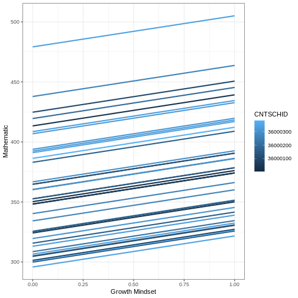
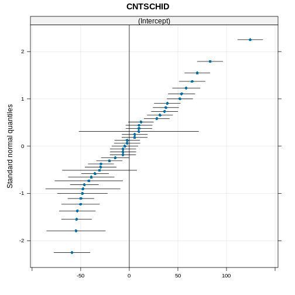
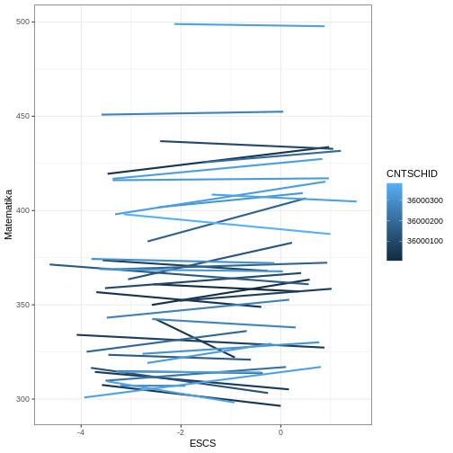
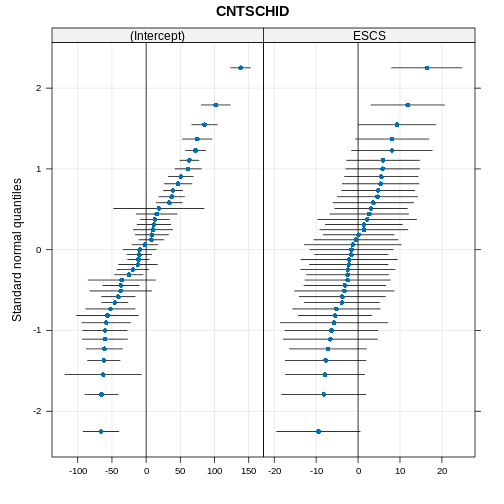

After reading the instruction of the exercise session, this page is going to show you how the exercise should work step by step. Note that it's possible to find an error and your code is not working the way it should be. First, make sure you have followed the steps correctly. Re-examine the code, perhaps you missed something *even one word or punctuation*. Read the `error`, it helps you to find the exact mistake you made in the code. 

## First Prep

Remember the first step in the lecture session? Always load the `package` to make the functions work. We need to load some `packages` before started to make any models.


``` r
library(tidyverse)
```

``` output
── Attaching core tidyverse packages ──────────────────────── tidyverse 2.0.0 ──
✔ dplyr     1.1.4     ✔ readr     2.1.5
✔ forcats   1.0.0     ✔ stringr   1.5.1
✔ ggplot2   3.5.1     ✔ tibble    3.2.1
✔ lubridate 1.9.3     ✔ tidyr     1.3.1
✔ purrr     1.0.2     
── Conflicts ────────────────────────────────────────── tidyverse_conflicts() ──
✖ dplyr::filter() masks stats::filter()
✖ dplyr::lag()    masks stats::lag()
ℹ Use the conflicted package (<http://conflicted.r-lib.org/>) to force all conflicts to become errors
```

`tidyverse` is going to help you read the data in certain format, such as `.csv`. 

## Call the Data

We need to call the data we're going to use with the function in the `tidyverse` package. 


``` r
pisa <- read.csv("data/pisa_idn_sample.csv")
```

`read.csv` function calls the data in `.csv` format. The other things before the slash is the name of the data being placed. While the `../` is a `html` command to call the data in different folder. In this case, `dataset` folder is not in the same folder with this page. 

## Random Intercept Model

### Begin Modeling

Before we're stepping into modeling, make sure we load the `package` to run the multilevel model `function`.


``` r
library(lme4)
```

``` output
Loading required package: Matrix
```

``` output

Attaching package: 'Matrix'
```

``` output
The following objects are masked from 'package:tidyr':

    expand, pack, unpack
```

Next step is modeling random intercept:


``` r
m1 <- lmer(MATH ~ 1 + growth +  (1 | CNTSCHID), data = pisa)
```

If you have created the model, now you can see the result by calling it with `summary`.

### View the Result


``` r
summary(m1)
```

``` output
Linear mixed model fit by REML ['lmerMod']
Formula: MATH ~ 1 + growth + (1 | CNTSCHID)
   Data: pisa

REML criterion at convergence: 13583.1

Scaled residuals: 
    Min      1Q  Median      3Q     Max 
-2.7730 -0.6292 -0.0256  0.6266  4.4737 

Random effects:
 Groups   Name        Variance Std.Dev.
 CNTSCHID (Intercept) 2083     45.64   
 Residual             1874     43.29   
Number of obs: 1297, groups:  CNTSCHID, 41

Fixed effects:
            Estimate Std. Error t value
(Intercept)  354.774      7.373  48.121
growth        25.891      2.613   9.907

Correlation of Fixed Effects:
       (Intr)
growth -0.122
```

If you want to make the result into a table, then you need function `tab_model`. Make sure you load `sjPlot` package to run the function.


``` r
library(sjPlot)
```

``` output
Install package "strengejacke" from GitHub (`devtools::install_github("strengejacke/strengejacke")`) to load all sj-packages at once!
```

``` r
tab_model(m1)
```

<table style="border-collapse:collapse; border:none;">
<tr>
<th style="border-top: double; text-align:center; font-style:normal; font-weight:bold; padding:0.2cm;  text-align:left; ">&nbsp;</th>
<th colspan="3" style="border-top: double; text-align:center; font-style:normal; font-weight:bold; padding:0.2cm; ">MATH</th>
</tr>
<tr>
<td style=" text-align:center; border-bottom:1px solid; font-style:italic; font-weight:normal;  text-align:left; ">Predictors</td>
<td style=" text-align:center; border-bottom:1px solid; font-style:italic; font-weight:normal;  ">Estimates</td>
<td style=" text-align:center; border-bottom:1px solid; font-style:italic; font-weight:normal;  ">CI</td>
<td style=" text-align:center; border-bottom:1px solid; font-style:italic; font-weight:normal;  ">p</td>
</tr>
<tr>
<td style=" padding:0.2cm; text-align:left; vertical-align:top; text-align:left; ">(Intercept)</td>
<td style=" padding:0.2cm; text-align:left; vertical-align:top; text-align:center;  ">354.77</td>
<td style=" padding:0.2cm; text-align:left; vertical-align:top; text-align:center;  ">340.31&nbsp;&ndash;&nbsp;369.24</td>
<td style=" padding:0.2cm; text-align:left; vertical-align:top; text-align:center;  "><strong>&lt;0.001</strong></td>
</tr>
<tr>
<td style=" padding:0.2cm; text-align:left; vertical-align:top; text-align:left; ">growth</td>
<td style=" padding:0.2cm; text-align:left; vertical-align:top; text-align:center;  ">25.89</td>
<td style=" padding:0.2cm; text-align:left; vertical-align:top; text-align:center;  ">20.76&nbsp;&ndash;&nbsp;31.02</td>
<td style=" padding:0.2cm; text-align:left; vertical-align:top; text-align:center;  "><strong>&lt;0.001</strong></td>
</tr>
<tr>
<td colspan="4" style="font-weight:bold; text-align:left; padding-top:.8em;">Random Effects</td>
</tr>

<tr>
<td style=" padding:0.2cm; text-align:left; vertical-align:top; text-align:left; padding-top:0.1cm; padding-bottom:0.1cm;">&sigma;<sup>2</sup></td>
<td style=" padding:0.2cm; text-align:left; vertical-align:top; padding-top:0.1cm; padding-bottom:0.1cm; text-align:left;" colspan="3">1874.27</td>
</tr>

<tr>
<td style=" padding:0.2cm; text-align:left; vertical-align:top; text-align:left; padding-top:0.1cm; padding-bottom:0.1cm;">&tau;<sub>00</sub> <sub>CNTSCHID</sub></td>
<td style=" padding:0.2cm; text-align:left; vertical-align:top; padding-top:0.1cm; padding-bottom:0.1cm; text-align:left;" colspan="3">2082.74</td>

<tr>
<td style=" padding:0.2cm; text-align:left; vertical-align:top; text-align:left; padding-top:0.1cm; padding-bottom:0.1cm;">ICC</td>
<td style=" padding:0.2cm; text-align:left; vertical-align:top; padding-top:0.1cm; padding-bottom:0.1cm; text-align:left;" colspan="3">0.53</td>

<tr>
<td style=" padding:0.2cm; text-align:left; vertical-align:top; text-align:left; padding-top:0.1cm; padding-bottom:0.1cm;">N <sub>CNTSCHID</sub></td>
<td style=" padding:0.2cm; text-align:left; vertical-align:top; padding-top:0.1cm; padding-bottom:0.1cm; text-align:left;" colspan="3">41</td>
<tr>
<td style=" padding:0.2cm; text-align:left; vertical-align:top; text-align:left; padding-top:0.1cm; padding-bottom:0.1cm; border-top:1px solid;">Observations</td>
<td style=" padding:0.2cm; text-align:left; vertical-align:top; padding-top:0.1cm; padding-bottom:0.1cm; text-align:left; border-top:1px solid;" colspan="3">1297</td>
</tr>
<tr>
<td style=" padding:0.2cm; text-align:left; vertical-align:top; text-align:left; padding-top:0.1cm; padding-bottom:0.1cm;">Marginal R<sup>2</sup> / Conditional R<sup>2</sup></td>
<td style=" padding:0.2cm; text-align:left; vertical-align:top; padding-top:0.1cm; padding-bottom:0.1cm; text-align:left;" colspan="3">0.037 / 0.544</td>
</tr>

</table>


### Visualise Model in `ggplot`

This step guide you to visualise the model you have created into a plot. 


``` r
pisa$m1 <- predict(m1)

pisa |> 
  ggplot(aes(growth, m1, color = CNTSCHID, group = CNTSCHID)) + 
  geom_smooth(se = F, method = lm) +
  theme_bw() +
  labs(x = "Growth Mindset", 
       y = "Mathematic", 
       color = "CNTSCHID")
```

``` output
`geom_smooth()` using formula = 'y ~ x'
```



### Visualise Model in `qqmath`


``` r
library(lattice)

qqmath(ranef(m1, condVar = TRUE))
```

``` output
$CNTSCHID
```




## Random Slope Model

Following the steps above is going to make random slope model easier. Although it is not the same model, the steps quite familiar and same `packages` used. We don't need to load the `packages` that we have loaded before. Now, it's just modeling, viewing, and visualise the model.

### Modeling

``` r
m2 <- m2 <- lmer(MATH ~ 1 + ESCS + (1 + ESCS | CNTSCHID), data = pisa)
```

### Viewing

We're going to see the result with `summary` and `tab_model` to see the model in table form.

**Summary**

``` r
summary(m2)
```

``` output
Linear mixed model fit by REML ['lmerMod']
Formula: MATH ~ 1 + ESCS + (1 + ESCS | CNTSCHID)
   Data: pisa

REML criterion at convergence: 13653.8

Scaled residuals: 
    Min      1Q  Median      3Q     Max 
-2.8809 -0.6318 -0.0380  0.6109  4.1509 

Random effects:
 Groups   Name        Variance Std.Dev. Corr
 CNTSCHID (Intercept) 2996.20  54.738       
          ESCS          61.09   7.816   0.79
 Residual             1961.08  44.284       
Number of obs: 1297, groups:  CNTSCHID, 41

Fixed effects:
            Estimate Std. Error t value
(Intercept)  367.305      9.069  40.503
ESCS           3.352      1.948   1.721

Correlation of Fixed Effects:
     (Intr)
ESCS 0.682 
```

**Table**

``` r
tab_model(m2)
```

<table style="border-collapse:collapse; border:none;">
<tr>
<th style="border-top: double; text-align:center; font-style:normal; font-weight:bold; padding:0.2cm;  text-align:left; ">&nbsp;</th>
<th colspan="3" style="border-top: double; text-align:center; font-style:normal; font-weight:bold; padding:0.2cm; ">MATH</th>
</tr>
<tr>
<td style=" text-align:center; border-bottom:1px solid; font-style:italic; font-weight:normal;  text-align:left; ">Predictors</td>
<td style=" text-align:center; border-bottom:1px solid; font-style:italic; font-weight:normal;  ">Estimates</td>
<td style=" text-align:center; border-bottom:1px solid; font-style:italic; font-weight:normal;  ">CI</td>
<td style=" text-align:center; border-bottom:1px solid; font-style:italic; font-weight:normal;  ">p</td>
</tr>
<tr>
<td style=" padding:0.2cm; text-align:left; vertical-align:top; text-align:left; ">(Intercept)</td>
<td style=" padding:0.2cm; text-align:left; vertical-align:top; text-align:center;  ">367.30</td>
<td style=" padding:0.2cm; text-align:left; vertical-align:top; text-align:center;  ">349.51&nbsp;&ndash;&nbsp;385.10</td>
<td style=" padding:0.2cm; text-align:left; vertical-align:top; text-align:center;  "><strong>&lt;0.001</strong></td>
</tr>
<tr>
<td style=" padding:0.2cm; text-align:left; vertical-align:top; text-align:left; ">ESCS</td>
<td style=" padding:0.2cm; text-align:left; vertical-align:top; text-align:center;  ">3.35</td>
<td style=" padding:0.2cm; text-align:left; vertical-align:top; text-align:center;  ">&#45;0.47&nbsp;&ndash;&nbsp;7.17</td>
<td style=" padding:0.2cm; text-align:left; vertical-align:top; text-align:center;  ">0.086</td>
</tr>
<tr>
<td colspan="4" style="font-weight:bold; text-align:left; padding-top:.8em;">Random Effects</td>
</tr>

<tr>
<td style=" padding:0.2cm; text-align:left; vertical-align:top; text-align:left; padding-top:0.1cm; padding-bottom:0.1cm;">&sigma;<sup>2</sup></td>
<td style=" padding:0.2cm; text-align:left; vertical-align:top; padding-top:0.1cm; padding-bottom:0.1cm; text-align:left;" colspan="3">1961.08</td>
</tr>

<tr>
<td style=" padding:0.2cm; text-align:left; vertical-align:top; text-align:left; padding-top:0.1cm; padding-bottom:0.1cm;">&tau;<sub>00</sub> <sub>CNTSCHID</sub></td>
<td style=" padding:0.2cm; text-align:left; vertical-align:top; padding-top:0.1cm; padding-bottom:0.1cm; text-align:left;" colspan="3">2996.20</td>

<tr>
<td style=" padding:0.2cm; text-align:left; vertical-align:top; text-align:left; padding-top:0.1cm; padding-bottom:0.1cm;">&tau;<sub>11</sub> <sub>CNTSCHID.ESCS</sub></td>
<td style=" padding:0.2cm; text-align:left; vertical-align:top; padding-top:0.1cm; padding-bottom:0.1cm; text-align:left;" colspan="3">61.09</td>

<tr>
<td style=" padding:0.2cm; text-align:left; vertical-align:top; text-align:left; padding-top:0.1cm; padding-bottom:0.1cm;">&rho;<sub>01</sub> <sub>CNTSCHID</sub></td>
<td style=" padding:0.2cm; text-align:left; vertical-align:top; padding-top:0.1cm; padding-bottom:0.1cm; text-align:left;" colspan="3">0.79</td>

<tr>
<td style=" padding:0.2cm; text-align:left; vertical-align:top; text-align:left; padding-top:0.1cm; padding-bottom:0.1cm;">ICC</td>
<td style=" padding:0.2cm; text-align:left; vertical-align:top; padding-top:0.1cm; padding-bottom:0.1cm; text-align:left;" colspan="3">0.53</td>

<tr>
<td style=" padding:0.2cm; text-align:left; vertical-align:top; text-align:left; padding-top:0.1cm; padding-bottom:0.1cm;">N <sub>CNTSCHID</sub></td>
<td style=" padding:0.2cm; text-align:left; vertical-align:top; padding-top:0.1cm; padding-bottom:0.1cm; text-align:left;" colspan="3">41</td>
<tr>
<td style=" padding:0.2cm; text-align:left; vertical-align:top; text-align:left; padding-top:0.1cm; padding-bottom:0.1cm; border-top:1px solid;">Observations</td>
<td style=" padding:0.2cm; text-align:left; vertical-align:top; padding-top:0.1cm; padding-bottom:0.1cm; text-align:left; border-top:1px solid;" colspan="3">1297</td>
</tr>
<tr>
<td style=" padding:0.2cm; text-align:left; vertical-align:top; text-align:left; padding-top:0.1cm; padding-bottom:0.1cm;">Marginal R<sup>2</sup> / Conditional R<sup>2</sup></td>
<td style=" padding:0.2cm; text-align:left; vertical-align:top; padding-top:0.1cm; padding-bottom:0.1cm; text-align:left;" colspan="3">0.003 / 0.528</td>
</tr>

</table>


### Visualise

Here, we're going to visualise the model through `ggplot` and `qqmath`.


``` r
pisa$m2 <- predict(m2)

pisa %>% 
  ggplot(aes(ESCS, m1, color = CNTSCHID, group = CNTSCHID)) + 
  geom_smooth(se = F, method = lm) +
  theme_bw() +
  labs(x = "ESCS", 
       y = "Matematika", 
       color = "CNTSCHID")
```

``` output
`geom_smooth()` using formula = 'y ~ x'
```




``` r
qqmath(ranef(m2, condVar = TRUE))
```

``` output
$CNTSCHID
```




